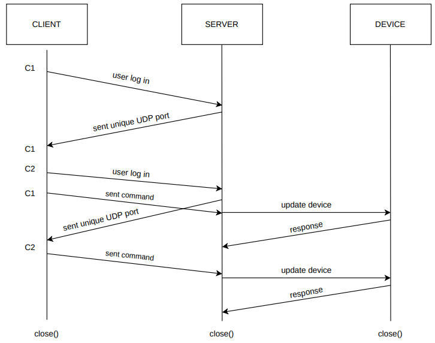
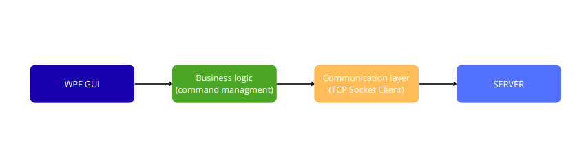
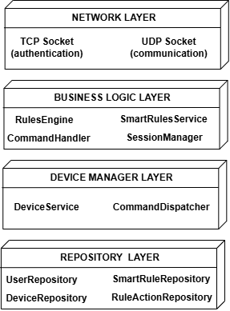
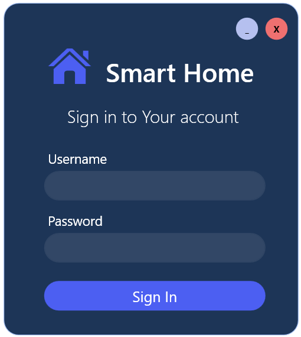
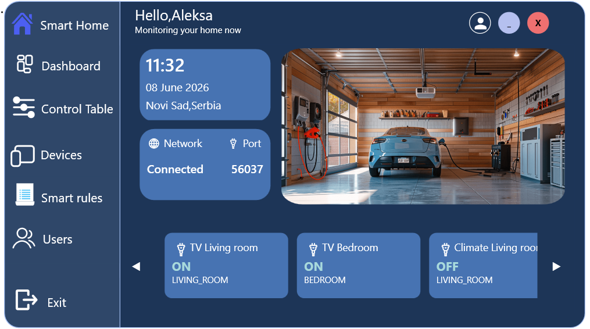

# 🏠 Smart Home System

A modern client-server based Smart Home system developed as the implementation part of a Bachelor's thesis.
The application enables centralized management of smart devices, secure communication between system components, and efficient monitoring of connected devices 
through an intuitive desktop application.

## 📋 Table of contents
- [About project](#-about-project)
- [Technologies](#-technologies)
- [Features](#-features)
- [Project structure](#-project-structure)
- [System architecture](#-system-architecture)
    - [Client architecture](#client-architecture)
    - [Server architecture](#server-architecture)
- [Database design](#-database-design)
- [Database configuration](#-database-configuration)
- [Running the project](#-running-the-project)
    - [Requirements](#requirements)
    - [Setup](#setup)
- [Screenshots](#-screenshots)
- [License](#-license)

## 📖 About project

The Smart Home system is not simply a collection of interconnected devices, but an integrated solution that combines communication technologies, automation, and security mechanisms in order to improve user comfort, energy efficiency, and home security.

The primary objective of this project is to provide centralized management of smart devices, continuous monitoring of their status, and reliable communication between different system components. The project was developed as the implementation part of a Bachelor's thesis.

## 💻 Technologies

#### Backend
- C#
- .NET
- TCP Sockets
#### Frontend
- WPF
- XAML
#### Database
- SQL Server Express
#### Security
- RSA Encryption
- AES Encryption
- Role-Based Access Control (RBAC)


## ✨ Features

- User authentication and authorization
- Role-Based Access Control (RBAC)
- Secure communication using RSA and AES encryption
- Centralized smart device management
- Smart rule creation and execution
- Command execution and monitoring
- Device status monitoring
- SQL Server database integration
- Client-server communication using TCP sockets

## 📁 Project structure

The project follows a layered architecture:
```text
SmartHome
│
├── Client              # WPF desktop application
├── Server              # TCP server
├── Common              # Shared models and utilities
├── SmartHomeDevices    # Device simulator
└── Database
    └── script.sql      # Database creation script
```

## 🌐 System architecture

The Smart Home system follows a client-server architecture. This architecture allows multiple clients and smart devices to communicate 
with a centralized server while maintaining data consistency, scalability, and easier application maintenance.

<p align="center">
  
</p>

### Client architecture

The client application is implemented as a desktop application using WPF and XAML. Its primary responsibility is to provide an intuitive graphical user interface 
for interacting with the Smart Home system.

<p align="center">
  
</p>

### Server architecture

The server application is implemented as a high-performance network application that utilizes non-blocking sockets together with an I/O multiplexing mechanism. This 
approach enables efficient handling of multiple simultaneous client connections without creating a dedicated thread for every connected client.

<p align="center">
  
</p>

## 📦 Database design

The application uses SQL Server Express as the primary relational database.

The database is organized into relational tables with clearly defined columns, data types, constraints, and relationships to ensure data consistency and integrity.

The database stores information about:

- Users
- Devices
- Smart Rules
- Rule Actions
- Commands
- Functions

## 🔧 Database configuration

To configure the database, follow these steps:

1. Install **SQL Server Express**.
2. Install **SQL Server Management Studio (SSMS)**.
3. Connect to the local SQL Server instance.
4. Execute the `SmartHome/Database/users_db.sql` script and `SmartHome/Database/devices_db.sql` script to create the required database and tables.

If you want to use a different database name or SQL Server instance, update the connection string in each repository located in: `Server/Repositories`.

Example: 
```text
private readonly string connectionString = "Server=localhost\\SQLEXPRESS;Database=users_db;Trusted_Connection=True;"
```

## 🚀 Running the project

### Requirements
Before running the project, make sure the following software is installed:

- Windows 10/11
- Visual Studio 2022
- SQL Server Express
- SQL Server Management Studio (SSMS)

### Setup
1. Clone the repository.
```bash
git clone https://github.com/aleksa1508/smart_home.git
```
2. Configure the SQL Server database.
3. Execute the `Database/script.sql` file.
4. Update the connection strings if necessary.
5. Verify that the clientPath variable inside `Server/Services/DeviceService.cs` points to the correct SmartHomeDevices executable.
6. Build the solution in Visual Studio.
7. Set multiple startup projects in Visual Studio:
   - Server (Start)
   - SmartHomeDevices (Start)
   - Client (Start)

8. Run the solution.

The Smart Home system is now ready to use.

## 📸 Screenshots

The following screenshots present the main user interface of the Smart Home application.

### Login Window
The login window allows users to enter their username and password in order to authenticate and connect to the Smart Home server.

<p align="center">
  
</p>

### Dashboard Window
After successful authentication, users can monitor and manage smart devices through the dashboard.

<p align="center">
  
</p>


## 📜 License

This project is licensed under the MIT License - see the [LICENSE](LICENSE) file for details.
